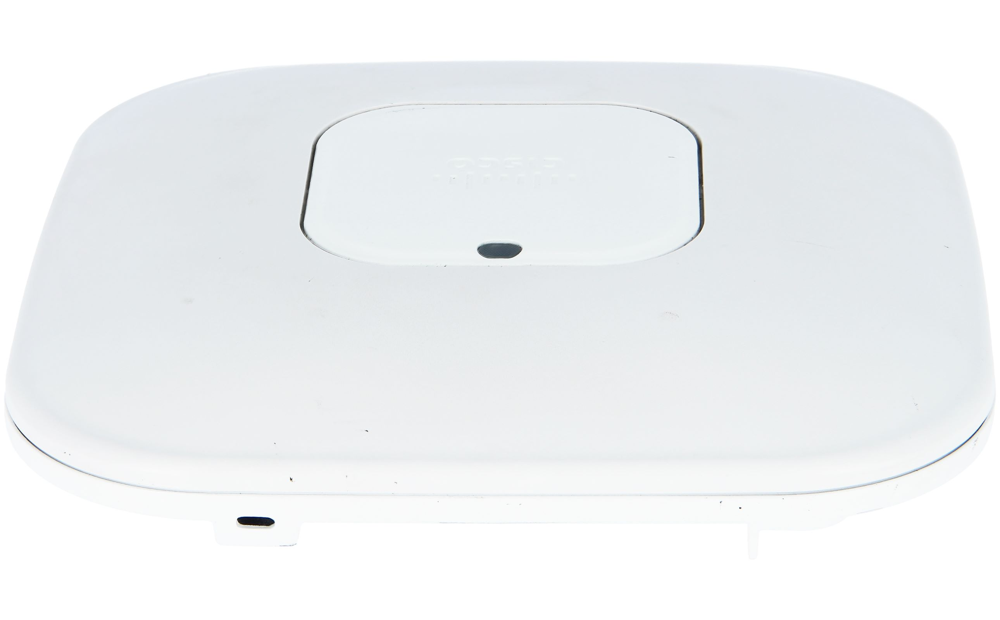
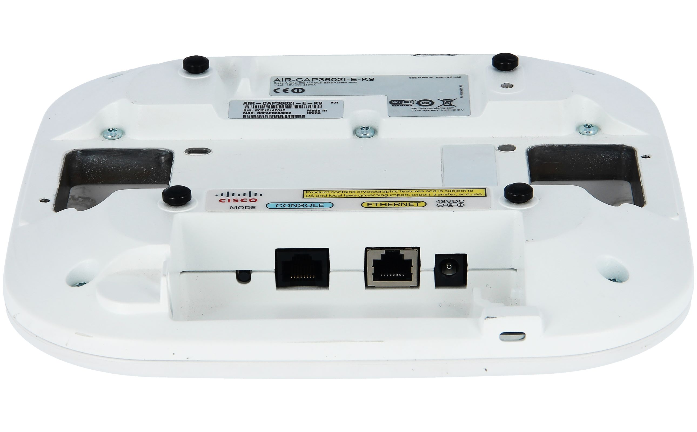
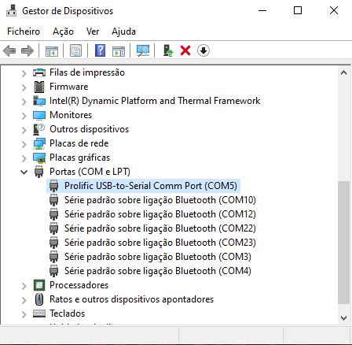
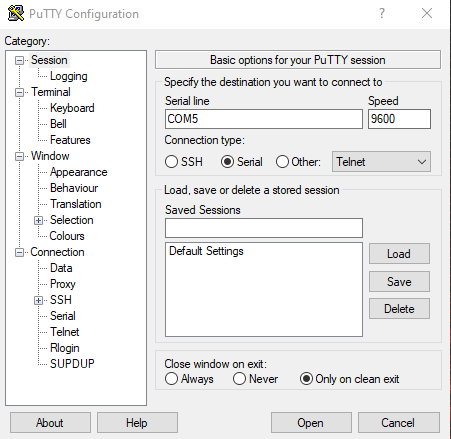
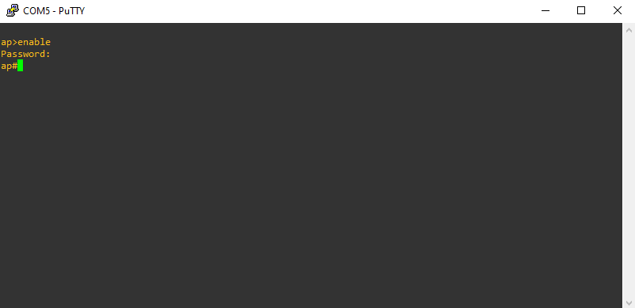

# cm-project-wlan2
Project for Comunicações Móveis - DETI UA

## Table of Contents
1. [About](#about)
1. [Cisco Access Point](#cisco-access-point)
    1. [Open Console](#open-console)
1. [Authors](#authors)

## About

In this project we will test and verify functional and performance characteristics of WLAN (Wireless LAN).

For this, we chose to approach the following topics:
- 802.11 coverage and performance
- Roaming between APs

For each topic, we give a brief introduction, explain our approach, how we setup the testing environment, show the configuration used in the AP(s) and show the results with images and charts.

You can find everything in the [project report](report.pdf).

## Cisco Access Point

**Model:** AIR-CAP3602I-E-K9
<p float="left">
  
  
</p>

The images above were taken from the [tonitrus.com]("https://www.tonitrus.com/es/redes/cisco/access-point-controller/cisco-3600-access-point/10106278-003-cisco-air-cap3602i-e-k9-802.11n-cap-w/cleanair-4x4-3ss-mod-int-ant-e-reg-domain/") website.

For this project, we were provided two Cisco Access Points by the professors of the subject.

### Open Console

To access the AP's console and make modifications to the configuration, we need a Console Cable (ethernet male to usb male). Upon connecting the AP to the computer, we need to identify the physical port it is connected to, and pass it to PuTTY through a Serial connection type. To identify to which port the AP is connected, we can use the Device Manager in Windows.

In Linux, we can check the lastly connected port using *dmesg*, through the command:
```
$ dmesg | grep USB
```

<p float="left">
  
  
</p>

In PuTTY, upon clicking Open, a terminal should open. To enter configuration mode, we must use the command **enable** and type the password, which is "Cisco" by default.



## Authors

|NMec | Name | Email|
|-----|------|------|
|88755 | Carlos Rafael de Jesus Palma Costa | carlospalmacosta@ua.pt|
|88930 | João Tomás Borges Simões | jtsimoes@ua.pt|
|90327 | Diogo Costa Correia | diogo.correia99@ua.pt|