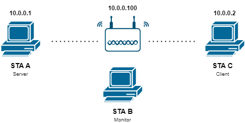

# cm-project-wlan2
Project for Comunicações Móveis - DETI UA

## Table of Contents
1. [Access Point Configurations](cisco_ap-conf.ios)
1. [RTS/CTS](#rtscts)
1. [802.11 perfomance (Signal Strenght and Bandwidth)](#80211-perfomance)
1. [Roaming between APs](#roaming-between-aps)

## RTS/CTS

To avoid collisions and preform a congestion control in the network traffic, RTS and CTS are used. These are control frames that request and confirm the possibility to send packets. A threshold can be set to specify the packet size from which the handshake should be done. Depending on that size and the network conditions, the handshake might not be necessary (small packets have less probability to collide).

### Approach

We will use a [WiFi Jammer](https://github.com/DanMcInerney/wifijammer) to flood the network and increase the probability of packet collisions. Then, we will vary the value of the RTS threshold to observe the handshaking mechanism in action, which should reduce the number of dropped packets.

### Setup

To perform this experimentation, we will create a network using an Access Point. We will have two PCs connected, one working as a Server and another as a Client. A third PC will serve as a Monitor, listening to all the communications between the former.

The WiFi Jammer will be running on the Monitor PC.  

## 802.11 perfomance

## Roaming between APs